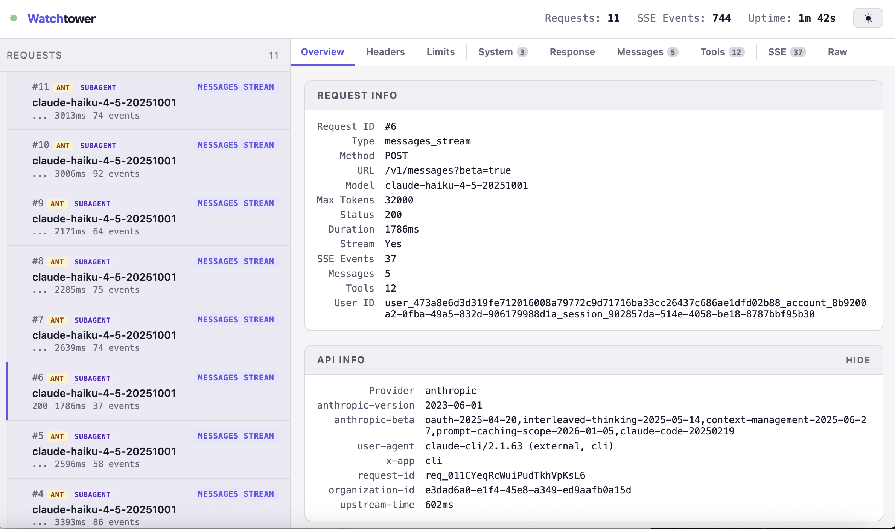

# claude-intercept

Intercept, inspect, and debug all API traffic between [Claude Code](https://docs.anthropic.com/en/docs/claude-code) and the Anthropic API — with a real-time web dashboard.

<!-- TODO: Add screenshot of dashboard here -->
<!--  -->

## Why

Claude Code makes multiple API calls per interaction — streaming messages, token counts, quota checks, subagent spawns — and you can't see any of it. This tool sits between Claude Code and the Anthropic API, captures everything, and gives you a live dashboard to inspect it all.

**What you get:**

- Every request and response, fully decoded
- SSE stream events in real time
- Agent hierarchy tracking (main agent, subagents, utility calls)
- Token usage, rate limits, and timing
- System prompts, tool definitions, message history
- All logged to disk as JSON for later analysis

## Quick Start

```bash
# Install and run
npx claude-intercept

# Or clone and run directly
git clone https://github.com/fahd09/claude-intercept.git
cd claude-intercept
npm install
npm start
```

Then start Claude Code pointing at the proxy:

```bash
ANTHROPIC_BASE_URL=http://localhost:8024 claude
```

Open the dashboard at **http://localhost:8025**.

## Usage

```bash
# Default ports: proxy=8024, dashboard=8025
node intercept.mjs

# Custom ports
node intercept.mjs 9000 9001
```

### Dashboard Tabs

| Tab | What it shows |
|-----|--------------|
| **Overview** | Duration, model, status, token counts, rate limits |
| **Messages** | Full conversation history (user/assistant messages) |
| **Response** | Pretty-printed response JSON |
| **Tools** | Tool definitions with searchable parameters and schemas |
| **Stream** | Raw SSE events with expandable payloads |
| **Headers** | Request and response headers |
| **Rate Limits** | Anthropic rate limit headers with visual progress bars |
| **Raw** | Complete request/response bodies as JSON |

### Request Classification

The proxy automatically classifies each request:

- `messages_stream` — Streaming chat completion (the main interaction)
- `messages` — Non-streaming chat completion
- `token_count` — Token counting call
- `quota_check` — Quota/permission check (`max_tokens=1`)

### Agent Roles

Each request is tagged with an agent role:

- **main** — The primary Claude Code agent (has the `Agent` tool)
- **subagent** — A spawned sub-agent (Explore, Plan, etc.)
- **utility** — Token counts and quota checks

### Logs

All requests are saved to `./logs/` as numbered JSON files:

```
logs/0001_messages_stream_claude-opus-4-6.json
logs/0002_token_count_claude-haiku-4-5-20251001.json
```

Each file contains the complete request/response cycle: headers, body, SSE events, timing, and rate limits.

## How It Works

```
Claude Code  ──HTTP──>  claude-intercept (proxy)  ──HTTPS──>  api.anthropic.com
                              │
                              ├── logs to disk
                              ├── broadcasts via WebSocket
                              │
                        Dashboard (web UI)
```

1. Claude Code sends requests to the local proxy instead of directly to `api.anthropic.com`
2. The proxy forwards each request to the real API
3. Responses (including SSE streams) are decoded, logged, and forwarded back
4. The dashboard connects via WebSocket for real-time updates

## Requirements

- Node.js >= 18

## Roadmap

See [TODO.md](TODO.md) for the full roadmap, including planned features like:

- Cost & token tracking
- Search & filter
- System prompt diffing
- Request replay & modification (Burp Suite for Claude)
- Agent hierarchy tree visualization

## Contributing

Contributions welcome. Open an issue first for anything non-trivial.

```bash
git clone https://github.com/fahd09/claude-intercept.git
cd claude-intercept
npm install
npm start
```

The entire proxy is in `intercept.mjs` (~425 lines) and the dashboard is in `dashboard.html` (~1800 lines). No build step.

## License

[MIT](LICENSE)
